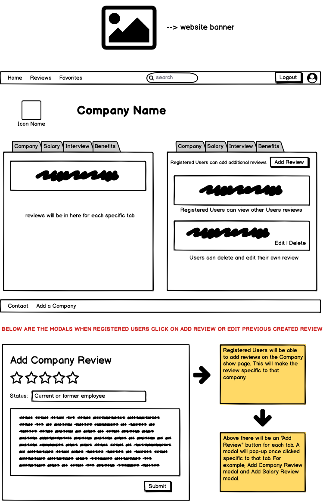

# Reputech 2.0

## Description

This website will compare the tech companies in Chicago based on reported ratings and reviews from different websites. Users can view and filter reviews to see which company fits them the most for various reasons.

## User Stories

#### Authentication
* User can register using OAuth.
* User can login with created credentials.
* User will be able to logout.
* User can update information.
* User can delete profile.
***
#### Website Actions - *(Login and authorization NOT required. Public user access.)*
* Functional navigation bar:
	* Home
	* Minimal search bar without filters in navigation bar.
	* Reviews
		* Search bar container will have filters User can select.
		* User can choose between filters:
			* Highest/lowest ratings/reviews in:
				* Overall
				* Salary
				* Benefits
				* Interviews
			* Number of ratings/reviews
			* Number of jobs available
* Companies will be displayed depending on User filter.
* User can click search and filtered results to display a modal with more company information and provide links if applicable such as company website, job posting, or direct link to review.
***
#### Website user interactions - *(User login required and authenticated)*
* User can add a review a company.
* User can will be able to edit and update their own created reviews.
* User can delete their own reviews.
* User will be able to favorite a company. Favorited companies will show on favorites list.
* User will have the option to remove an item off the favorite list. 

### Development Process
   DATE 		 | 		  PROGRESS     |     BLOCKS 		 |  	 GOALS     |
------------ | ----------------- | --------------- | ------------- |
03/23/2020 | Initialized project, read React hooks documentation, watched lesson videos  | None | **3 day sprint**: Basic layout function (navbar), Auth, login modal |

### Wireframes
***

##### Home Page 
* Users will see the homepage which provides brief description about the functionaly and purpose of the application.
***

##### Reviews Page 
* Users will be able to view/sort companies based on ratings.
***

##### Favorites Page 
* Registered users will be able to see companies they marked as a favorite.
***

##### Company Page 
* Once user clicks on a company, it will take them to the company page. User can view reviews in detail. Registered users can add/edit/delete reviews.
***

##### Profile Page 
* Users can click on registered users profiles. Registered users can edit/update/delete own profile once logged in and authenticated.